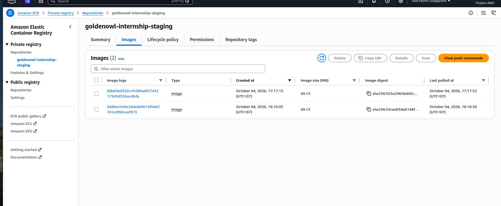
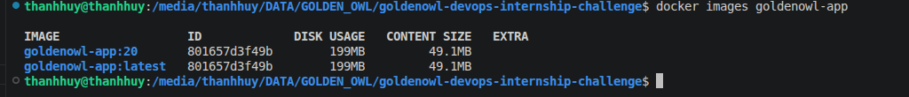
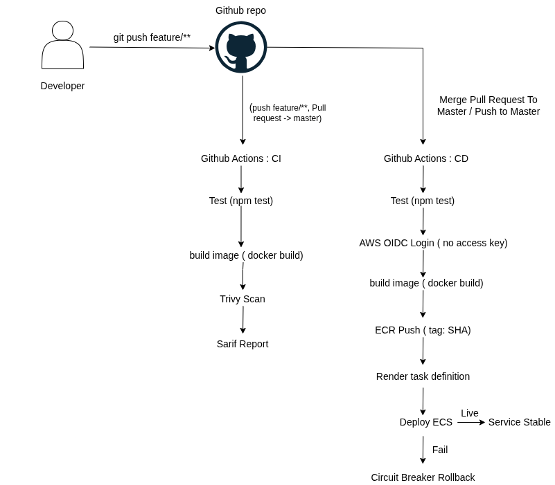
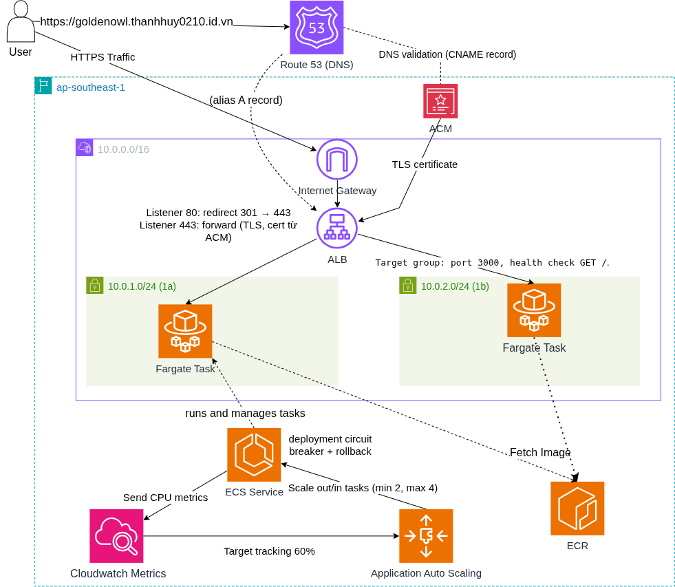

# Golden Owl DevOps Internship - Solution

A Node.js (Express) app, containerized and deployed on **Amazon ECS (Fargate)** behind an **Application Load Balancer** with **HTTPS** and **target-tracking auto scaling**. All cloud infrastructure is provisioned with **Terraform** and deployed through **GitHub Actions**.

```bash
curl https://goldenowl.thanhhuy0210.id.vn
# {"message":"Welcome warriors to Golden Owl!"}
```

## Submission

| Item | Value |
|---|---|
| Public GitHub repository | https://github.com/Nguyen-Thanh-Huy-io/goldenowl-devops-internship-challenge |
| Deployment link | https://goldenowl.thanhhuy0210.id.vn |
| Visual flow diagram (manually created in draw.io) | [CI/CD flow](diagram/CI_CD_Pipeline.png) · [AWS architecture](diagram/architecture.png) |
| Final Docker image size | **49.1 MB** compressed (ECR) / 199 MB on disk |

## Submission Overview

| Requirement | Implementation Details | Status |
|---|---|---|
| Container Registry | Amazon ECR `goldenowl-internship-staging` (immutable tags = commit SHA, scan on push) | ✅ Done |
| Visual Flow Diagram | [`diagram/cicd-flow.png`](diagram/cicd-flow.png), [`diagram/aws-architecture.png`](diagram/aws-architecture.png) (manually created in draw.io) | ✅ Done |
| CI Automation | GitHub Actions [`ci.yml`](.github/workflows/ci.yml): test, build, Trivy scan on push to `feature/**` | ✅ Done |
| CD Automation | GitHub Actions [`cd.yml`](.github/workflows/cd.yml): build, push to ECR, deploy to ECS on merge to `master` (AWS access via OIDC) | ✅ Done |
| Infrastructure as Code | Terraform ([`terraform/`](terraform/)): VPC, ALB, ECR, ECS Fargate, IAM, ACM, Route 53 | ✅ Done |
| Load Balancing & Auto Scaling | AWS ALB + ECS Fargate service (Target Tracking CPU 60%, min 2 / max 4 tasks) | ✅ Done |
| Security Scanning (Bonus ⭐) | Trivy in CI (SARIF report, gate on CRITICAL) + ECR scan on push | ✅ Done |
| HTTPS Support (Bonus ⭐) | ACM certificate on the ALB, HTTP redirects to HTTPS | ✅ Done |
| Automatic Rollback (Bonus ⭐) | ECS deployment circuit breaker with rollback + `wait-for-service-stability` in CD | ✅ Configured |
| Terraform (Bonus ⭐) | All AWS resources defined in Terraform, except the pre-created Route 53 hosted zone (see "Manual steps outside Terraform") | ✅ Done |


### Image size evidence

**ECR (compressed size)**



&nbsp;

**Local `docker images` (on disk)**


## Highlights

- **Image optimization:** cut the image from 315 MB to 199 MB on disk (64 MB to 49.1 MB compressed) by finding dev-only packages wrongly listed in `dependencies`.
- **Security:** Trivy scan in CI with a gate on CRITICAL findings; Express dependencies patched with `npm audit fix` (0 production vulnerabilities); ECR scan on push.
- **No stored AWS credentials:** GitHub Actions authenticates through OIDC, restricted to this repo's `master` branch.
- **Traceable releases:** immutable ECR tags using the commit SHA, plus a deployment circuit breaker for automatic rollback.
- **Iterative history:** small, focused commits across feature branches and pull requests.

## Diagrams (drawn manually in draw.io)

### CI/CD flow


### AWS architecture


Source file: `diagram/architecture.drawio`

## Docker image

`src/Dockerfile` (multi-stage, non-root):

- Stage 1 installs production dependencies only (`npm ci --omit=dev`).
- Stage 2 copies only `node_modules` and the app source and runs as the `node` user.
- `.dockerignore` keeps `node_modules`, `.git`, `.env` and docs out of the build context.
- npm, corepack and yarn are removed from the final image. This does not shrink the image (deleted files remain in earlier layers) but reduces attack surface and removes npm's bundled packages from vulnerability scans.

| Step | On disk | Compressed |
|---|---|---|
| First multi-stage build | 315 MB | 64 MB |
| Moved `eslint-plugin-jest` and `nodemon` to `devDependencies` | 198 MB | 49.1 MB |

The two dev-only packages were pulling about 100 MB of `typescript`, `@typescript-eslint` and `eslint` into the production image.

Base image is `node:20-alpine`. Node 20 has passed its end-of-life date, so upgrading is recommended for real use: change the two `FROM` lines and `node-version` in the workflows. Node 22 produced a larger image in my test (242 MB on disk / 61.4 MB compressed).

## CI/CD

| Workflow | Trigger | Steps |
|---|---|---|
| `ci.yml` | push to `feature/**`, PR into `master` | `npm ci`, `npm test`, build image, Trivy scan (SARIF report, fails on CRITICAL) |
| `cd.yml` | push to `master` | test, build image, push to ECR (tag = commit SHA), render task definition, deploy to ECS and wait for stability |

- AWS authentication uses **GitHub OIDC**: no long-lived access keys. The IAM role trusts only this repository's `master` branch.
- ECR tags are **immutable** and use the commit SHA, so every deployment is traceable.
- CI builds the image only to validate and scan it. CD rebuilds and pushes the image that is actually deployed.

## Infrastructure (Terraform, `terraform/`)

| File | Resources |
|---|---|
| `vpc.tf` | VPC, internet gateway, 2 public subnets (2 AZs), route table |
| `security_groups.tf` | ALB (80/443 from internet), ECS tasks (3000 only from ALB) |
| `ecr.tf` | ECR repository (immutable tags, scan on push), lifecycle policy (keep 10 images) |
| `alb.tf` | ALB, target group (ip, port 3000, `GET /`), listener 80 (redirect), listener 443 |
| `dns_https.tf` | ACM certificate (DNS validation), Route 53 validation and alias records |
| `ecs.tf` | ECS cluster, Fargate task definition, service with deployment circuit breaker |
| `autoscaling.tf` | Application Auto Scaling target and CPU target-tracking policy |
| `iam.tf` | Task execution role, GitHub OIDC provider and deploy role |
| `cloudwatch.tf` | Log group for container logs |

**Auto scaling:** target tracking on `ECSServiceAverageCPUUtilization` at 60%, min 2 / max 4 tasks. ECS publishes the metric to CloudWatch and Application Auto Scaling manages the scale-out and scale-in alarms.

## Design decisions

- **Public subnets, no NAT Gateway.** Tasks have public IPs but their security group only accepts traffic from the ALB. This avoids the NAT Gateway cost. A production setup would use private subnets with NAT or VPC endpoints.
- **ECS Fargate** instead of EC2 + Auto Scaling Group: no servers to manage, native rolling deployments and circuit breaker.
- **Flat Terraform layout** because there is a single environment; would be refactored into modules for multiple environments.
- **Local Terraform state** (git-ignored) for speed; a team setup would use an S3 backend with locking.
- Terraform ignores `task_definition` and `desired_count` changes on the ECS service, because CD registers new task definitions and auto scaling manages the task count.

## Manual steps outside Terraform

- The domain `thanhhuy0210.id.vn` was registered at PA Vietnam and its name servers were pointed to Route 53.
- The Route 53 hosted zone was created once with the AWS CLI. Terraform reads it with a data source and manages the records inside it.
- The `AWS_ROLE_ARN` GitHub secret was set by hand from the Terraform output.

## Deploy / destroy

```bash
cd terraform
terraform init
terraform apply
terraform destroy   # then delete the Route 53 hosted zone manually
```